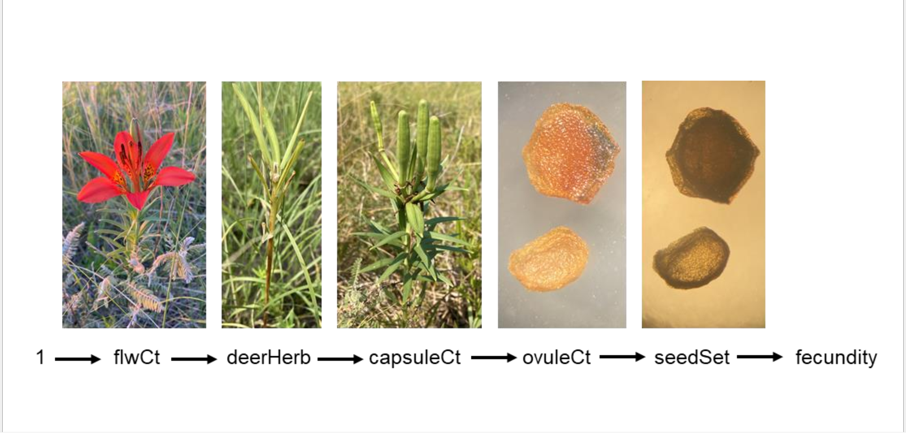

# Analyzing Lilium fitness with Aster model

## About this project

This project studies how distance-dependent processes influence *Lilium philadelphicum* reproductive fitness in western Minnesota, with [aster modeling technique](https://academic.oup.com/biomet/article-abstract/94/2/415/224189). This project is still on-going(so data is not posted here) and this repo houses my work on it so far.

## Acknowledgement

Thank [Dr. Jared Beck](https://jaredjbeck.github.io/) and [Dr. Stuart Wagenius](https://www.chicagobotanic.org/research/staff/wagenius) for this amazing data set!\
And thank [Professor Daniel Eck](https://stat.illinois.edu/directory/profile/dje13) for mentoring me througout the project!

## Aster model

Aster model is a "generalized Generalized Linear Model", designed for life history analysis of plants and animals, that allows for joint analysis of multiple variables while correcly accounting for their dependency structures.

For more theoretical background and real data analyses with aster:

- [Aster models for life history analysis](https://academic.oup.com/biomet/article-abstract/94/2/415/224189)
- [Unifying Life-History Analyses for Inference of Fitness and Population Growth](https://www.jstor.org/stable/10.1086/588063?seq=1)
- [An integrated analysis of phenotypic selection on insect body size and development time](https://onlinelibrary.wiley.com/doi/abs/10.1111/evo.12744)
- [A Widespread Chromosomal Inversion Polymorphism Contributes to a Major Life-History Transition, Local Adaptation, and Reproductive Isolation](https://journals.plos.org/plosbiology/article?id=10.1371/journal.pbio.1000500)
- [Do Interactions among Microbial Symbionts Cause Selection for Greater Pathogen Virulence?](https://www.journals.uchicago.edu/doi/full/10.1086/717679)

## Work so far

- PreAnalysis.[Rmd|pdf]: Data cleaning and basic model fitting.
- Subsampling.[r|Rmd|pdf]: Developing a computing procedure for calculating expected fitness with random effects model and correctly accounting for sub-sampling node.
- Include_nnB.[Rmd|pdf]: A new covariate `nn[k]DistNotConsumed` is included in modeling. The issue of it only having valid values on some of individuals is handled.
- HandCrafted_ModMat.[Rmd|pdf]: A study showing that the handcrafting model matrix technique suggested in [TR658](chrome-extension://efaidnbmnnnibpcajpcglclefindmkaj/https://www.stat.umn.edu/geyer/aster/tr658.pdf) is not necessary for our data set.
- Model_Selection.[Rmd|pdf]: some models of particular interest in biological sense are fitted and model selection procedure by AIC is conducted.
- MoreModels_Landscape.[Rmd|pdf]: more models are fitted; model landscapes are generated; tail behavior is noticed and studied. 

## Log

2023/4/17: update README\
2023/4/14: first commit

